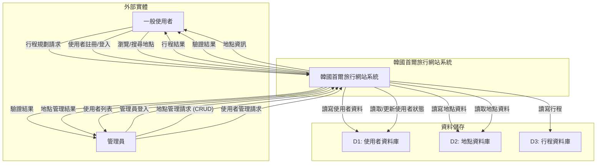
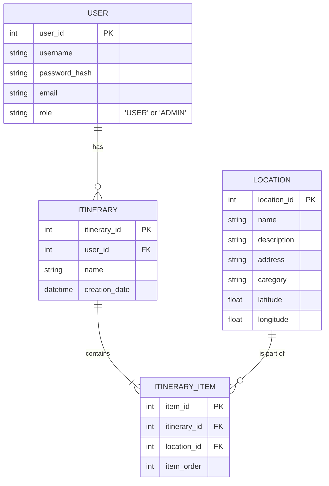

# 軟體架構文件 (SA) - 韓國首爾旅行網站 (v2)

## 1. 緒論

### 1.1. 專案目的
本專案旨在建立一個功能完整且易於使用的首爾旅遊網站。主要目標是讓「一般使用者」能夠輕鬆探索首爾的景點、餐廳和購物區，並規劃個人旅遊行程。同時，提供「管理員」一個後台，以維護網站內容的品質與正確性。

### 1.2. 專案範圍
- **一般使用者功能**:
  - 註冊與登入。
  - 瀏覽、搜尋地點資訊。
  - 建立、編輯、儲存、刪除個人行程。
- **管理員功能**:
  - 登入後台系統。
  - 對地點資訊進行新增、修改、刪除 (CRUD)。
  - 管理使用者帳戶 (例如：查看列表、停用帳戶)。

### 1.3. 角色定義 (Role Definitions)
- **一般使用者 (User)**: 網站的主要使用者，如學生、上班族、自由行旅客，他們使用網站來規劃行程。
- **管理員 (Administrator)**: 負責維護網站內容的正確性與即時性，確保地點資訊無誤，並管理使用者社群的秩序。

---

## 2. 使用者需求 (User Requirements)

### 2.1. 功能性需求 (Functional Requirements)

#### 一般使用者
| 需求編號 | 需求描述 | 優先級 |
| :--- | :--- | :--- |
| **UR-001** | 我希望能瀏覽不同分類 (景點、美食、購物) 的地點資訊。 | **高** |
| **UR-002** | 我希望能透過關鍵字搜尋地點。 | **高** |
| **UR-003** | 我希望能註冊一個新帳戶。 | **高** |
| **UR-004** | 我希望能登入和登出我的帳戶。 | **高** |
| **UR-005** | 我希望能建立、編輯、儲存和刪除我的旅行行程。 | **高** |
| **UR-006** | 我希望能將地點加入或移出我的行程。 | **高** |
| **UR-007** | 我希望能在我選擇的行程頁面，於地圖上看到所有地點的標記。 | **中** |

#### 管理員
| 需求編號 | 需求描述 | 優先級 |
| :--- | :--- | :--- |
| **AR-001** | 我希望能登入一個與前台區分的管理後台。 | **高** |
| **AR-002** | 我希望能新增、檢視、修改、刪除網站上的地點資訊。 | **高** |
| **AR-003** | 我希望能看到所有已註冊的使用者列表。 | **中** |
| **AR-004** | 我希望能停用或重新啟用特定使用者的帳戶。 | **中** |

### 2.2. 非功能性需求 (Non-Functional Requirements)
(與前版相同，此處省略以求簡潔)

---

## 3. 資料流程圖 (Data Flow Diagram - DFD)

此 DFD 已更新，包含「管理員」角色。

### 3.1. DFD 圖例
- **外部實體**: `一般使用者`, `管理員`
- **處理程序**: `韓國首爾旅行網站系統`
- **資料儲存**: `使用者資料庫`, `地點資料庫`, `行程資料庫`

### 3.2. 第 0 層 DFD

---

## 4. 系統架構 (System Architecture)

(與前版相同，此處省略以求簡潔)

---

## 5. 資料模型 (Data Modeling)

### 5.1. 實體關係圖 (ERD)
`USER` 表已更新，加入 `role` 欄位以區分一般使用者和管理員。

### 5.2. 實體說明
- **USER**: 新增 `role` 欄位，用於區分 `'USER'` (一般使用者) 和 `'ADMIN'` (管理員)。

---

## 6. 部署考量 (Deployment Considerations)

(與前版相同，此處省略以求簡潔)