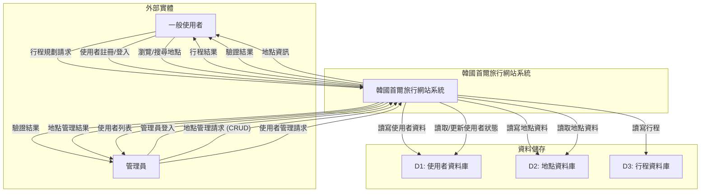
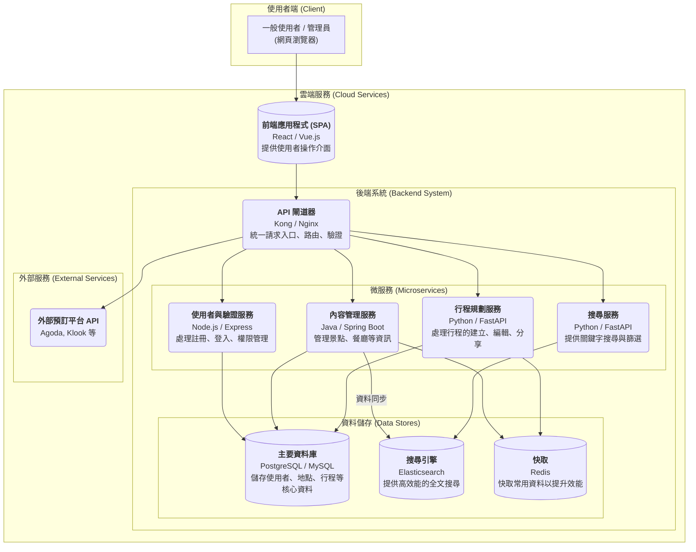
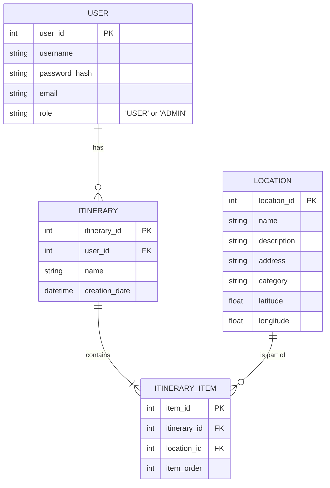

# 軟體架構文件 (SA) - 韓國首爾旅行網站 (v2)

## 1. 緒論

### 1.1. 專案目的
本專案旨在建立一個功能完整且易於使用的首爾旅遊網站。主要目標是讓「一般使用者」能夠輕鬆探索首爾的景點、餐廳和購物區，並規劃個人旅遊行程。同時，提供「管理員」一個後台，以維護網站內容的品質與正確性。

### 1.2. 專案範圍
- **一般使用者功能**:
  - 註冊與登入。
  - 瀏覽、搜尋地點資訊。
  - 建立、編輯、儲存、刪除個人行程。
- **管理員功能**:
  - 登入後台系統。
  - 對地點資訊進行新增、修改、刪除 (CRUD)。
  - 管理使用者帳戶 (例如：查看列表、停用帳戶)。

### 1.3. 角色定義 (Role Definitions)
- **一般使用者 (User)**: 網站的主要使用者，如學生、上班族、自由行旅客，他們使用網站來規劃行程。
- **管理員 (Administrator)**: 負責維護網站內容的正確性與即時性，確保地點資訊無誤，並管理使用者社群的秩序。

---

## 2. 使用者需求 (User Requirements)

### 2.1. 功能性需求 (Functional Requirements)

#### 一般使用者
| 需求編號 | 需求描述 | 優先級 |
| :--- | :--- | :--- |
| **UR-001** | 我希望能瀏覽不同分類 (景點、美食、購物) 的地點資訊。 | **高** |
| **UR-002** | 我希望能透過關鍵字搜尋地點。 | **高** |
| **UR-003** | 我希望能註冊一個新帳戶。 | **高** |
| **UR-004** | 我希望能登入和登出我的帳戶。 | **高** |
| **UR-005** | 我希望能建立、編輯、儲存和刪除我的旅行行程。 | **高** |
| **UR-006** | 我希望能將地點加入或移出我的行程。 | **高** |
| **UR-007** | 我希望能在我選擇的行程頁面，於地圖上看到所有地點的標記。 | **中** |

#### 管理員
| 需求編號 | 需求描述 | 優先級 |
| :--- | :--- | :--- |
| **AR-001** | 我希望能登入一個與前台區分的管理後台。 | **高** |
| **AR-002** | 我希望能新增、檢視、修改、刪除網站上的地點資訊。 | **高** |
| **AR-003** | 我希望能看到所有已註冊的使用者列表。 | **中** |
| **AR-004** | 我希望能停用或重新啟用特定使用者的帳戶。 | **中** |

### 2.2. 非功能性需求 (Non-Functional Requirements)
(與前版相同，此處省略以求簡潔)

---

## 3. 資料流程圖 (Data Flow Diagram - DFD)

此 DFD 已更新，包含「管理員」角色。

### 3.1. DFD 圖例
- **外部實體**: `一般使用者`, `管理員`
- **處理程序**: `韓國首爾旅行網站系統`
- **資料儲存**: `使用者資料庫`, `地點資料庫`, `行程資料庫`

### 3.2. 第 0 層 DFD

---

## 4. 系統架構 (System Architecture)

本系統採用基於微服務 (Microservices) 的現代化架構，將前端與後端分離，並將後端功能拆解為多個獨立的服務。這種設計提高了系統的靈活性、可擴展性和可維護性。

### 4.1. 系統架構圖

### 4.2. 元件說明

-   **前端應用程式 (SPA - Single Page Application)**
    -   **技術**: 建議使用 React 或 Vue.js 等現代 JavaScript 框架。
    -   **職責**: 提供所有使用者互動介面，包括景點瀏覽、行程規劃以及管理員後台。它是一個獨立的應用程式，透過 API 與後端溝通。

-   **API 閘道器 (API Gateway)**
    -   **技術**: 可選用 Kong, Nginx, 或雲端服務商提供的閘道器 (如 AWS API Gateway)。
    -   **職責**: 作為系統的單一入口點。處理所有傳入的請求，並根據路徑將其轉發到對應的微服務。此外，它還負責處理身分驗證、速率限制 (Rate Limiting) 和日誌記錄等共用功能。

-   **微服務 (Microservices)**
    -   **使用者與驗證服務**: 負責處理使用者註冊、登入、登出及 JWT (JSON Web Token) 的簽發與驗證。
    -   **內容管理服務**: 負責所有旅遊地點資訊 (景點、餐廳、購物) 的 CRUD (新增、讀取、更新、刪除) 操作。管理員將主要與此服務互動。
    -   **行程規劃服務**: 負責處理使用者的個人化行程，包括建立、修改、讀取、刪除行程，以及將地點加入行程中。
    -   **搜尋服務**: 提供強大的搜尋功能。它與「搜尋引擎」互動，以實現高效的全文搜尋、篩選和排序。

-   **資料儲存 (Data Stores)**
    -   **主要資料庫 (SQL DB)**: 使用如 PostgreSQL 或 MySQL 的關聯式資料庫，儲存結構化資料，如使用者帳戶、地點詳細資訊、行程等，確保資料的完整性與一致性。
    -   **搜尋引擎 (Search Engine)**: 使用 Elasticsearch，專門用於索引和搜尋大量文字資料。內容管理服務會將資料同步至此，以提供快速的搜尋回應。
    -   **快取 (Cache)**: 使用 Redis 等記憶體資料庫，快取熱門地點、使用者 Session 等常用資料，以降低主資料庫負載並加速 API 回應。

-   **外部服務 (External Services)**
    -   **外部預訂平台 API**: 用於整合第三方合作夥伴（如 Agoda, Klook）的預訂功能。當使用者點擊預訂時，系統會透過 API 閘道器呼叫這些外部服務。

---

## 5. 資料模型 (Data Modeling)

### 5.1. 實體關係圖 (ERD)
`USER` 表已更新，加入 `role` 欄位以區分一般使用者和管理員。

### 5.2. 實體說明
- **USER**: 新增 `role` 欄位，用於區分 `'USER'` (一般使用者) 和 `'ADMIN'` (管理員)。

---

## 6. 部署考量 (Deployment Considerations)

(與前版相同，此處省略以求簡潔)